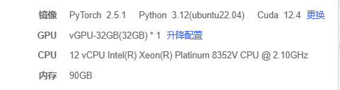

## Chinese-MedQA-Qwen2
- 本项目是一个基于Qwen2+Agent+RAG的医疗问答系统
- 该项目的目的, 是为了打通从 `SFT/Embedding医疗训练数据生成`，到 `SFT微调`， 到`奖励模型微调`，到 `DPO/DAPO/GSPO/TRPO` 微调， 到使用 vllm 对最终模型进行部署与推理， 再到使用 AgentFactory 调用 医疗多 Agent 会诊系统 (mdagents) 进行问诊的整个流水线。

- 最终本项目将会基于上述后训练方式，来微调出一个使用西医知识来进行疾病诊疗的垂直qwen2模型。


## 项目内容
1. 手动构建 SFT+DPO 的Trainer.(SFT由huggingface的Trainer实现，DPO 是由 [LLaMA-Factory](https://github.com/hiyouga/LLaMA-Factory) 实现, 用户也可以选择我们手动编写的DPOTrainer【注意，这是我手写的！和trl库里的那个DPOTrainer不是同一个】)
2. 推理实现：用户可以选择两种推理方式：1.使用 vllm。2.用户也可以切换成 xinference。
3. 本项目也参考了LongChain-Chatchat的项目框架：【1】包括 XInference的基本使用(主要是模型的加载与推理)。
4. 参考了LongChain-Chatchat的架构，在Chinese-MedQA的文档匹配算法中加入KNN（原本只有相似度、BM25、L2_distance）。【3】使用FAISS构建了本地医疗知识库。


## 修复日志

### 2026-04-14 代码审查与修复

**审查结果：**
- 严重问题：17项（已全部修复）
- 中等问题：16项
- 轻微问题：26项

**主要修复内容：**

1. **导入/逻辑修复 (9项)**
   - `agent_factory.py`: 修正导入路径 `AgentBase` → `BaseAgent`
   - `xinference_inference.py`: 修正 logger 导入 `get_logger` → `setup_logger`
   - `inference_pipline.py`: 移除不存在的 `fastllm_inference` 模块导入
   - `inference_utils.py`: 修正类名 `ModelConfig` → `LocalModelConfig`
   - `api_model.py`: 修正变量名 `self.api_base` → `self.base_url`
   - `medical_agent.py`: 修正 RAGPipeline 方法调用 `retrieve()` → `query()`
   - `base_agent.py`: 修正工具执行循环变量覆盖问题
   - `milvus_client.py`: 修正 logger 变量 `logger` → `self.logger`
   - `evaluation.py`: 添加缺失的 logger 导入

2. **配置安全修复 (3项)**
   - `api/client.py`: 移除模块级 HTTP 请求，BASE_URL 改用环境变量
   - `api/admin.py`: API_KEY 强制从环境变量读取
   - `api/main.py`: CORS 配置改用环境变量

3. **训练相关修复 (4项)**
   - `base_trainer.py`: 修复频繁评估问题，添加评估间隔控制
   - `dpo_trainer.py`: 修复 DPO 损失计算，使用 attention_mask 仅在响应位置计算
   - `transformers_inference.py`: 移除 vLLM 特有参数，适配 AutoModelForCausalLM

4. **配置重构**
   - `milvus_config.py`: 改用环境变量 `MILVUS_URI`、`MILVUS_TOKEN` 等
   - 日志统一使用 `LoggerManager`，输出目录改为 `/Users/xiniuyiliao/Desktop/code/Chinese-MedQA-Qwen2/logs`
   - 创建训练 YAML 配置文件：`examples/train/sft.yaml`、`dpo.yaml`、`grpo.yaml`、`reward_model.yaml`、`embedding.yaml`

5. **遗留问题 (2项 - 均为测试代码)**
   - `inference_pipline.py:412`: 测试代码占位符
   - `milvus_client.py:602`: 测试代码 token


## 参考的项目
- Agent部分 参考了：
  1.  [AgentGPT](https://github.com/reworkd/AgentGPT.git)
  2.  [Camel](https://github.com/camel-ai/camel.git)
- 医疗RAG实现+工具调用+数据库部分参考了 [Medical-Graph-RAG](https://github.com/SuperMedIntel/Medical-Graph-RAG.git)
- RAG检索算法+项目结构参考了 [Langchain-Chatchat](https://github.com/chatchat-space/Langchain-Chatchat.git)


## 技术栈总结
1. 基础模型: Qwen2（同时支持本地部署和智谱API调用）
2. 微调框架:
  - SFT: 基于Hugging Face Trainer实现
  - DPO: 手动构建的DPOTrainer，参考LLaMA-Factory
3. 推理加速:
  - FastLLM（基于C++的推理库）
  - VLLM（大规模部署时的推理加速）
4. 知识库与检索:
  - FAISS向量数据库（高效相似性搜索）
  - 多种检索算法：相似度、BM25、L2距离、KNN
5. Agent实现:
  - 参考AgentGPT和Camel项目
6. 项目框架:
  - 参考Langchain-Chatchat和Medical-Graph-RAG的项目结构


## 项目设计图
```

```


## 项目文件架构
```
chinese-medqa-qwen2/
├── README.md                          # 项目介绍和使用说明
├── requirements.txt                   # 项目依赖
├── config/                            # 配置文件目录
│   ├── model_config.py                # 模型配置
│   ├── rag_config.py                  # RAG配置
│   └── agent_config.py                # Agent配置
├── data/                              # 数据目录
│   ├── raw/                           # 原始医疗数据
│   ├── processed/                     # 处理后的数据
│   ├── embeddings/                    # 文档嵌入
│   └── indices/                       # FAISS索引文件
├── models/                            # 模型相关代码
│   ├── base_model.py                  # 基础模型类
│   ├── qwen_model.py                  # Qwen2模型封装
│   ├── api_model.py                   # 智谱API模型封装
│   └── model_utils.py                 # 模型工具函数
├── training/                          # 训练相关代码
│   ├── trainer/                       # 训练器实现
│   │   ├── sft_trainer.py             # SFT训练器
│   │   └── dpo_trainer.py             # DPO训练器(手写)
│   ├── dataset/                       # 数据集处理
│   │   ├── medical_dataset.py         # 医疗数据集类
│   │   └── data_processor.py          # 数据处理工具
│   └── scripts/                       # 训练脚本
│       ├── run_sft.py                 # 运行SFT训练
│       └── run_dpo.py                 # 运行DPO训练
├── inference/                         # 推理相关代码
│   ├── fastllm_inference.py           # FastLLM推理
│   ├── vllm_inference.py              # VLLM推理
│   ├── api_inference.py               # API推理
│   └── inference_utils.py             # 推理工具函数
├── knowledge_base/                    # 知识库相关代码
│   ├── document_loader.py             # 文档加载器
│   ├── document_processor.py          # 文档处理
│   ├── embedding_manager.py           # 嵌入管理
│   └── retrieval/                     # 检索相关代码
│       ├── retriever_base.py          # 基础检索器
│       ├── similarity_retriever.py    # 相似度检索
│       ├── bm25_retriever.py          # BM25检索
│       ├── l2_retriever.py            # L2距离检索
│       └── knn_retriever.py           # KNN检索
├── rag/                               # RAG相关代码
│   ├── rag_pipeline.py                # RAG流水线
│   ├── query_processor.py             # 查询处理
│   ├── context_builder.py             # 上下文构建
│   └── response_generator.py          # 响应生成
├── agent/                             # Agent相关代码
│   ├── agent_base.py                  # 基础Agent类
│   ├── medical_agent.py               # 医疗Agent实现
│   ├── tool_manager.py                # 工具管理
│   └── tools/                         # 工具实现
│       ├── tool_base.py               # 基础工具类
│       ├── search_tool.py             # 搜索工具
│       ├── calculator_tool.py         # 计算工具
│       └── medical_reference_tool.py  # 医疗参考工具
├── web/                               # Web界面
│   ├── app.py                         # Web应用
│   ├── static/                        # 静态资源
│   └── templates/                     # 模板文件
├── api/                               # API服务
│   ├── main.py                        # API主入口
│   ├── routers/                       # API路由
│   └── schemas/                       # API模式定义
├── utils/                             # 通用工具
│   ├── logger.py                      # 日志工具
│   ├── metrics.py                     # 评估指标
│   ├── file_utils.py                  # 文件工具
│   └── text_utils.py                  # 文本处理工具
└── tests/                             # 测试代码
    ├── test_models.py                 # 模型测试
    ├── test_rag.py                    # RAG测试
    ├── test_agent.py                  # Agent测试
    └── test_integration.py            # 集成测试
```


## 模型介绍
Qwen2 is based on the Transformer architecture with SwiGLU activation, attention QKV bias, group query attention, etc. 

Qwen2-7B-Instruct supports a context length of up to 131,072 tokens.


## 数据集

#### SFT数据集
- 字段格式：{"instruction"..., "input":..., "output":...}
```python
from datasets import load_dataset

ds = load_dataset("ticoAg/Chinese-medical-dialogue")
```

#### DPO数据集
- 字段格式：{"prompt"..., "chosen":..., "rejected":...}
```python
from datasets import load_dataset

ds = load_dataset("Morefreedai/medical-dpo-v1")

```


## 权重下载


## SFT
一轮LoRA/SFT + 一轮DPO，其余步骤根据后续效果再加


## Evaluation
微调结束后，我们会使用evaluate_model.py来让llama3.1给GPT4o和和Qwen2生成的答案打分。


## Environment Config
- AutoDL Cloud Platform
  


- then, make sure to pre-download the model weight (e.g. Qwen2.5-1.5B on the huggingface) to the local storage (e.g., `/root/autodl-tmp/models/Qwen2.5-1.5B`).


## 如何运行本项目
#### 1. 先把项目拉到本地，比如 /你的本地目录/Chinese-MedQA-Qwen2

#### 2. 配置LLaMA-Factory
1. 拉取LLaMA-Factory到本地，并确保LLaMA-Factory目录和Chinese-MedQA-Qwen2目录处于同一层级，例如：
 ```python  
     -----你的本地目录
                |------Chinese-MedQA-Qwen2
                |------LLaMA-Factory
```


2. 安装依赖
 ```python  
    cd LLaMA-Factory
    pip install -r requirements.txt
    pip install -e ".[torch,metrics]"
```


#### 3. 配置fastllm
```python
git clone https://github.com/ztxz16/fastllm.git

cd ./fastllm    
```

```python
pip install -r requirements.txt
```

```python  
-----你的本地目录
          |------Chinese-MedQA-Qwen2
          |------LLaMA-Factory
          |------fastllm
```
1. 安装gcc
```python
# 确认是否已经安装
gcc --version

# 安装
# For Debian based distributions like Ubuntu
sudo apt-get install gcc

# For RPM-based distributions like CentOS
sudo yum install gcc
```

3. 安装cmake
```python
sudo apt install cmake -y
cmake  --version
```

4. 编译
 ```python
bash install.sh -DUSE_CUDA=ON # 编译GPU版本
# bash install.sh -DUSE_CUDA=ON -DCUDA_ARCH=89 # 可以指定CUDA架构，如4090使用89架构, A100使用80架构
```
4. 跑起来
```python
# openai api server
# 需要安装依赖: pip install -r requirements-server.txt
# 这里在8080端口打开了一个模型名为qwen的server
python3 -m ftllm.server -t 16 -p ~/Qwen2-7B-Instruct/ --port 8080 --model_name qwen

# 使用float16精度的模型对话
python3 -m ftllm.chat -t 16 -p ~/Qwen2-7B-Instruct/ 

# 在线量化为int8模型对话
python3 -m ftllm.chat -t 16 -p ~/Qwen2-7B-Instruct/ --dtype int8

# webui
# 需要安装依赖: pip install streamlit-chat
python3 -m ftllm.webui -t 16 -p ~/Qwen2-7B-Instruct/ --port 8080
```


